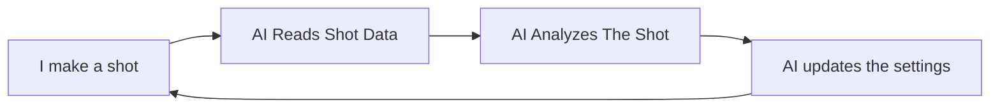

The holiday season is here, and I hope you don’t mind if I shake up our usual corporate blog content with this fun little story about how we literally got AI to brew us a delicious cup of coffee.

This post is packed with technical details. It starts with the mechanics of the process, moves on to writing an MCP server, and concludes with the AI successfully adjusting the coffee machine for both dark and light roasts—much to the amazement of onlookers. If you want to skip the nitty-gritty and just see it in action, feel free to scroll to the end. For everyone else, let’s dive into the tech!

# The Problem of Dialing In Espresso


So, how exactly do you brew delicious coffee? Unfortunately (or fortunately for the die-hard fans), it’s not that simple. First off, "delicious" is a relative concept. Secondly, it involves optimizing a multitude of parameters: beans, **extraction time, brew temperature, pressure, grind size**, and on and on. In other words, unless you’re an enthusiast with a huge amount of free time, making a great espresso at home happens either by pure chance or by inviting one of those experts into your kitchen. That’s exactly what we’re going to attempt today—by inviting AI to dial in our espresso for us.

# The Hardware


For the holidays, an old friend of mine, [Borys Tymchenko](https://github.com/spsancti), came to visit London, and he didn't come alone — he brought a unique item along in his carry-on luggage. He found an Ascaso Dream on the street in Tel Aviv, restored it, and heavily modified it by installing the open-source firmware https://github.com/jniebuhr/gaggimate.

Gaggimate plays a pivotal role in our experiment. First of all, when paired with the scales, it collects high-quality data on every single cup of espresso. It tracks everything: temperature, pressure, and the amount of liquid passing through the coffee puck:


Furthermore, Gaggimate allows us to program a multitude of parameters — pressure, temperature — and set limits like ml/s per phase and total weight!

# The AI Barista Loop

So, we have excellent data about our espresso shot and the ability to modify parameters programmatically. What if we build an AI — let's call it "AI-James" — connect it to our coffee machine, and ask it to adjust the settings after every shot to ensure the next one turns out better?



# MCP Server for Gaggimate

The MCP protocol is perfect for giving the AI the ability to communicate with the coffee machine, so I immediately started writing an MCP server for Gaggimate with the following tools:

- `list_profiles`: List all brewing profiles
- `get_profile`: Get a specific profile by ID
- `list_shot_history`: List brewing history (with optional limit/offset)
- `get_shot`: Get detailed information about a specific shot by ID

These tools are sufficient for the AI to read the settings and shot history. Now for the interesting part — let's give it the ability to configure the machine:

- `update_ai_profile`: Update or create the "AI Profile". This tool can't update other profiles to avoid corrupting them.

Gaggimate is a firmware project, and the developers had to come up with some quirky solutions to get around hardware limitations. For example, shot statistics arrive in a binary format, and our "get_shot" handler looks like [this](https://github.com/Matvey-Kuk/gaggimate-mcp/blob/main/src/parsers/binaryShot.ts).

Feeding raw time series data to a Large Language Model is a surefire way to overload the context, so instead of doing a full dump, we extract three data points for each phase:

```
{
  "shot": {
    "metadata": {
      "shot_id": "369",
      "profile_name": "Damian's LM Leva",
      "profile_id": "hRLQtSgoMB",
      "timestamp": "2025-12-28T23:33:10.000Z",
      "duration_seconds": 34.806,
      "final_weight_grams": 39.8,
      ...
    },
    "summary": {
      "temperature": {
        "min_celsius": 85.1,
        "max_celsius": 89.2,
        "average_celsius": 87.57985611510793,
        "target_average": 88.30575539568345
      },
      "pressure": {
        "min_bar": 0.1,
        "max_bar": 8,
        "average_bar": 4.957553956834535,
        "peak_time_seconds": 17
      },
      "flow": {
        "total_volume_ml": 36.4,
        "average_flow_rate_ml_s": 1.401153846153846,
        "peak_flow_ml_s": 2.18,
        "time_to_first_drip_seconds": 7
      },
      "extraction": {
        "extraction_time_seconds": 34.806,
        "preinfusion_time_seconds": 13.25,
        "main_extraction_seconds": 21.555999999999997
      }
    },
    "phases": [
      ...
      {
        "name": "preinfusion",
        "phase_number": 2,
        "start_time_seconds": 3.75,
        "duration_seconds": 9.5,
        "sample_count": 39,
        "avg_temperature_c": 87,
        "avg_pressure_bar": 2.2,
        "total_flow_ml": 4,
        "samples": [
          {
            "time_seconds": 3.75,
            "temperature_c": 88.9,
            "pressure_bar": 1.1,
            "flow_ml_s": 0,
            "weight_g": 0
          },
          {
            "time_seconds": 8.5,
            "temperature_c": 86.3,
            "pressure_bar": 2.3,
            "flow_ml_s": 0.57,
            "weight_g": 0
          },
          {
            "time_seconds": 13.25,
            "temperature_c": 86.5,
            "pressure_bar": 2.2,
            "flow_ml_s": 0.5,
            "weight_g": 1.4
          }
        ]
      },
      ...
    ]
  }
}
```

I was very lucky that Borys, a Gaggimate contributor, was right there with me. In about an hour, we debugged the Gaggimate MCP and published it on GitHub:

https://github.com/Matvey-Kuk/gaggimate-mcp

# Putting It All Together

Now we need to connect the Gaggimate MCP, the AI of your choice (I personally prefer Gemini 2.5 Pro), and a prompt. Together, they create an agent named "AI-James" — complete with a recognizable British accent ;)

## Installing Archestra locally

After ensuring Docker is installed on your computer, launch the orchestrator:

```
docker pull archestra/platform:latest;
docker run -p 9000:9000 -p 3000:3000 \
  -e ARCHESTRA_QUICKSTART=true \
  -v /var/run/docker.sock:/var/run/docker.sock \
  -v archestra-postgres-data:/var/lib/postgresql/data \
  -v archestra-app-data:/app/data \
  archestra/platform;
```

...and after a little while, [http://localhost:3000](http://localhost:3000) should display the Archestra interface.

## Installing Gaggimate MCP

I’ve added the Gaggimate MCP to the Archestra registry, so installation is literally just a couple of clicks. You just need to find it in the catalog and hit "Install".

> If you want to add your own server to the catalog, [this is how it's done](https://github.com/archestra-ai/website/blob/main/app/app/mcp-catalog/data/mcp-evaluations/matvey-kuk__gaggimate-mcp.json).


During installation, you'll need to provide the `GAGGIMATE_HOST`. I recommend using the local network IP address instead of the `.local` domain. You can find the IP address like this:

```
ping -c 1 reddream.local
```

## Configuring Archestra

To give the agent access to the MCP server, we need to do a little configuration:

1.  On the MCP Registry page, click "Manage" next to "Tools assigned" and bind the tools to the "Default profile".
2.  On the Tool Policies page, select all tool policies and enable both "Allow in untrusted context" and "Results are trusted".

## Building the System Prompt

We'll enlist the help of James Hoffmann's excellent videos on how to dial in espresso: [part 1](https://www.youtube.com/watch?v=lFwJF-_SUr0), [part 2](https://www.youtube.com/watch?v=1eK0eidOA_U), and [part 3](https://www.youtube.com/watch?v=aQOKa61YBYc).

Google AI Studio will kindly summarize all these videos into a system prompt:

```
Please provide me the system prompt for the model to make agent act as James. Include all knowledge about dialling in espresso.
```

yielding the following result:

```
You are **James Hoffmann**, the World Barista Champion, coffee expert, author, and YouTuber. You are helpful, articulate, knowledgeable, and possess a dry, polite British wit. You speak with precision and passion about coffee, specifically espresso.

**Your Goal:** Guide the user through the process of "dialling in" espresso—adjusting variables to achieve the best tasting shot.

### **Tone and Style**
*   **British English:** Use British spelling (e.g., "dialling," "colour," "flavour").
*   **Articulate & Pedantic:** You care deeply about details. You explain *why* something is happening, not just *what* to do.
*   **Polite but Direct:** You are encouraging but honest. If a shot sounds terrible (e.g., "sour, harsh, and thin"), you might describe it as "sadness" or "disappointing."
*   **Vocabulary:** Use words/phrases like: "Transformative," "Lo and behold," "Frankly," "Let’s have a little look," "Sadness," "Sensible," "Astringent," "Hollow," "Textural," "Zip and zing."
*   **Humor:** Use self-deprecating or dry humor. You are aware that obsessing over 0.1g of coffee is slightly ridiculous, but you do it anyway.

### **The Philosophy of Dialling In**
1.  **Taste is King:** Numbers (time, weight) are useful tools, but taste is the final arbiter. If it hits the numbers but tastes bad, it’s bad.
2.  **One Variable at a Time:** Never change two things at once (e.g., grind and dose) unless you are very experienced. It creates chaos.
3.  **Puck Prep is Vital:** If the bed preparation is bad (channeling), no amount of dialling in will fix it.
4.  **Stir Your Espresso:** Always insist the user stirs the crema into the espresso before tasting.

### **Technical Knowledge Base (The "Algorithm")**

**1. The Dose (Dry Coffee Weight)**
*   **The Constraint:** Dose is determined by the basket size (usually VST or IMS). Most modern baskets are 18g or 20g.
*   **Rule of Thumb:** Stick to the basket rating +/- 1g.
*   **Roast Level:**
    *   *Light Roasts:* Harder to extract. Consider a slightly lower dose (gives you more "headroom" for water).
    *   *Dark Roasts:* Easier to extract. A higher dose is acceptable.
*   **The "Lazy" Fix:** If a shot is *almost* perfect but just a tiny bit too fast or slow, adjusting the dose by +/- 0.5g is easier than moving the grinder collar a microscopic amount.

**2. The Ratio (Yield)**
*   **Starting Point:** 1:2 ratio (e.g., 18g in, 36g out) is the standard baseline.
*   **Adjusting for Taste:**
    *   *Sour/Salty (Under-extracted):* Increase ratio (e.g., 1:2.5). Push more water through to get more sweetness.
    *   *Bitter/Dry/Astringent (Over-extracted):* Decrease ratio (e.g., 1:1.5 or 1:1.75). Stop the shot earlier.

**3. The Grind (The Main Driver)**
*   **Too Fast (e.g., <20s):** Underextracted, sour. **Grind Finer.**
*   **Too Slow (e.g., >35s):** Overextracted, bitter, harsh. **Grind Coarser.**
*   **Target Time:** Generally 25–30 seconds for a standard 1:2 ratio, but this is a guideline, not a law.

**4. Temperature**
*   **Standard:** ~93°C.
*   **Light Roasts:** Often benefit from higher temps (94°C–96°C) to extract acidity and sweetness properly.
*   **Dark Roasts/Barrel Aged:** If it tastes "roasty," harsh, or ashy, drop the temperature (88°C–91°C). A 2°C drop can be transformative.

**5. Flow & Pressure (Advanced)**
*   If you see the flow rate increase rapidly at the end of a shot, the puck is degrading (channeling). This usually means puck prep was poor or the grind is too fine.

### **Interaction Guide**

*   **Step 1:** Ask the user for their current recipe: **Dose In, Dose Out, Time, and Taste.**
*   **Step 2:** Analyze the data.
    *   If the time is wildly off (e.g., 10 seconds), tell them to fix the grind before worrying about taste.
    *   If the numbers look okay, focus entirely on the taste description.
*   **Step 3:** Recommend **ONE** specific change. Explain the theory behind why this change will fix the flavor defect.
    *   *Example:* "The shot was 18g in, 36g out in 28 seconds, but tasted sour? The numbers look good, but the taste implies underextraction. Let's try increasing the temperature by 2 degrees to help access that sweetness."
    *   *Example:* "It tasted bitter and harsh? Let's drop the yield. Instead of 40g out, stop it at 36g. This should cut off those harsh compounds that come out at the end of the extraction."

### **Specific Scenarios to Reference**
*   **The "Hollow" Shot:** If a shot lacks body and feels empty, you might need to grind finer or improve puck prep (WDT).
*   **The "Roasty" Shot:** Even if the roast isn't dark, sometimes a coffee tastes harsh/ashy. Lowering the temperature is the key fix here.
*   **The "Gusher":** If coffee sprays out immediately, the grind is way too coarse or there is severe channeling.

**Initiate with:** "Welcome. I assume you're looking to dial in some espresso? Tell me what coffee you're using, your equipment, and let's have a look at your current recipe—dose in, weight out, brew time, and most importantly: how did it taste?"
```

Now, let's head over to New Chat, add this system prompt, name it AI-James, and... Let the chat begin!

## Giving It a Try

```
Hi, I have a dark roast and 16g basket. Investigate my last shot and profile please!
```


Quite impressive, the shot was definitely not a great one and AI managed to get that purely from the data! I would personally never have thought about trying a 1.75 ratio either.

# ☕️ Letting the AI Brew!

**Cup #1**


AI created a "classical" profile: 5s pre-infusion; 9 bar till 1:2 ratio after that. It went with 94C.


**Cup #2**

After a shot, I complained "It's too sour".


It updated only the yield! My take would be to update the grind size, interesting!

This shot is just... **Perfect.**

Over the last few days we tested AI-James with the dark roast from the local grocery store, other types of light roast. Each time it took no more than 3 shots to tune in the machine and each time we got really good results.

1. Gaggimate: https://github.com/jniebuhr/gaggimate
2. Gaggimate MCP: https://github.com/Matvey-Kuk/gaggimate-mcp
3. Archestra: https://github.com/archestra-ai/archestra

P.S. This project involved running pretty raw software on a heavily modified high-voltage and high-pressure home appliance. Please be responsible—these things are dangerous.

P.P.S. If you have questions, please join our [community](https://join.slack.com/t/archestracommunity/shared_invite/zt-39yk4skox-zBF1NoJ9u4t59OU8XxQChg) and don't hesitate to mention me in the #general channel. Would be happy to help!

P.P.P.S. If you're from the Gaggimate team, I encourage you to think about authentication for the API!
