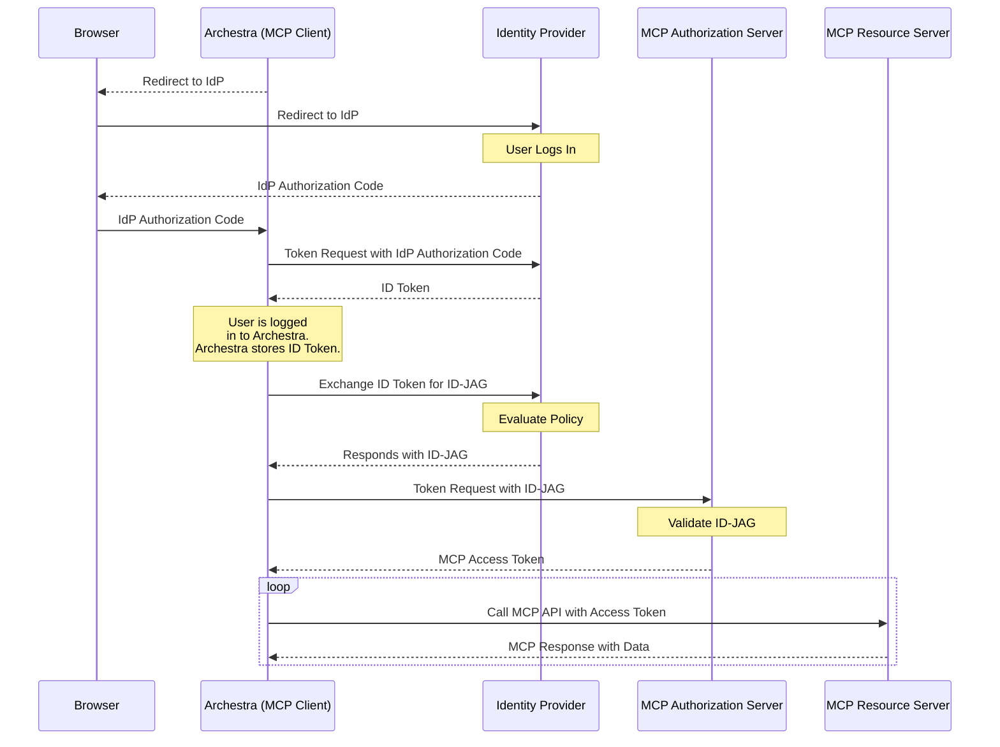

## SSO Gets You Into the Client. Enterprise-Managed Authorization Gets You Into the Server.

In most enterprise MCP setups today, users can already sign in to tools like Claude Desktop, Cursor, or internal chat apps through their company's identity provider (IdP). But that does not automatically give those tools access to MCP servers exposed through Archestra. The user may already be authenticated to the client, but the MCP server's authorization server still needs a grant it can validate and turn into an MCP access token.

The new [Enterprise-Managed Authorization](https://modelcontextprotocol.io/extensions/auth/enterprise-managed-authorization) extension fills that gap.

It gives Archestra, acting as an MCP client, a standard way to take an enterprise identity assertion it already has, exchange it through the company's identity provider, and turn it into an MCP access token for a specific server. In practical terms: if your company already trusts the user and already has a policy engine, Archestra can use that existing trust to get access to enterprise-approved MCP servers without prompting the user to re-authorize each one manually.

> **tl;dr** Archestra [v1.2.0](https://github.com/archestra-ai/archestra/releases/tag/platform-v1.2.0) adds support for MCP Enterprise-Managed Authorization at the MCP Gateway layer, and also adds Archestra's separate enterprise-managed downstream credential flow for Agents and MCP Gateways inside the platform.

_This is Part 3 of a three-part series on MCP authentication. [Part 1](/blog/mcp-authentication-guide) covers OAuth 2.1, PKCE, discovery, and client registration. [Part 2](/blog/enterprise-mcp-servers-jwks) covers JWKS validation for enterprise MCP servers._

## The Problem This Solves

Standard MCP auth already gives us a solid foundation: OAuth 2.1, PKCE, discovery, client registration, and audience-bound tokens. But enterprise environments introduce a different requirement:

- the user is already signed in to Archestra with the company's identity provider
- the company wants central policy over which MCP servers are allowed
- the company wants visibility into app-to-app access, not just user login
- the user should not need to run a separate auth flow for every internal server

That's the hole this spec targets.

Instead of asking the MCP server to trust the raw enterprise identity token directly, the flow adds an intermediate grant that is specific to the target server and specific to Archestra as the requesting client. That keeps the enterprise policy decision with the IdP, while still letting the MCP server issue its own access token.

## The Flow, Step by Step

The extension is built on three layers:

1. **Single sign-on** to Archestra via OpenID Connect or SAML
2. **Token Exchange (RFC 8693)** at the enterprise identity provider
3. **JWT Authorization Grant (RFC 7523)** at the MCP server's authorization server

The MCP spec's flow looks like this:

Here's what is happening:

1. The user signs in to Archestra through the enterprise identity provider.
2. Archestra receives an enterprise identity assertion or other subject token the identity provider is willing to exchange.
3. Archestra asks the identity provider to exchange that identity assertion for a new JWT-based grant targeted at a specific MCP server or Archestra gateway.
4. The identity provider evaluates enterprise policy and returns an **Identity Assertion JWT Authorization Grant**, or **ID-JAG**.
5. Archestra sends that ID-JAG to the MCP server's authorization server using the JWT bearer grant. In Archestra's case, that is the gateway token endpoint.
6. The MCP authorization server validates the ID-JAG and issues a normal MCP access token.
7. Archestra uses that access token to call the MCP server.

That split matters. The identity provider is making a policy decision. The MCP authorization server, or Archestra gateway, is still the component that issues the access token used on actual MCP requests.

There is one important prerequisite underneath all of this: both Archestra and the MCP authorization server need an established trust relationship with the same enterprise identity provider. Without that shared trust anchor, there is nothing for the ID-JAG to extend.

## Authorization Server vs Resource Server

One bit of OAuth language can make this post feel more abstract than it really is: the distinction between the **authorization server** and the **resource server**.

In this flow, the **authorization server** is the component that validates the grant and issues the final access token. The **resource server** is the component that receives that access token on actual MCP requests and returns tools, resources, or other MCP responses.

In some architectures, those are separate systems. In others, they are just two roles implemented by the same product.

Using Archestra as the practical example:

- the **MCP server's authorization server** is the Archestra gateway token endpoint that validates the ID-JAG and mints the final MCP access token
- the **MCP resource server** is the Archestra MCP gateway endpoint that receives `tools/list`, `tools/call`, and other MCP requests authenticated with that token

If you want to map that to a familiar SaaS pattern, think about GitHub:

- `github.com/login/oauth/access_token` is part of the authorization side because it issues tokens
- `api.github.com` is the resource side because it receives those tokens on actual API requests

Same idea here. The identity provider does not directly hand Archestra a token for the MCP API. It hands Archestra a grant. The MCP authorization server turns that grant into an access token, and the MCP resource server is what finally accepts that token on real MCP traffic.

## What the ID-JAG Actually Does

The most important object in this flow is the **ID-JAG**.

It's a signed JWT from the enterprise identity provider that says, in effect:

- who the user is
- that Archestra requested access on behalf of the user
- which MCP authorization server is the intended audience
- which MCP resource is being targeted
- which scopes are allowed

This extension is not "send the enterprise JWT directly to the MCP server." It is "use enterprise identity to obtain a grant that the MCP authorization server can validate and convert into an MCP-native access token." The spec requires the JWT to carry claims like `aud`, `resource`, and `client_id`, and the JWT header `typ` must be `oauth-id-jag+jwt`.

Those constraints give the MCP server enough context to answer the questions that matter:

- Was this grant minted for **my** authorization server?
- Was it intended for **this** MCP resource?
- Was it issued for **Archestra** as the requesting client?
- Was it scoped correctly?

That makes the grant far safer than treating a generic enterprise identity token as an access token.

It is also important not to confuse the ID-JAG with the final MCP access token. The IdP returns the ID-JAG from token exchange, but that object is still an assertion. The MCP authorization server validates it and only then issues the Bearer token Archestra uses for actual MCP calls.

One subtle implementation detail: in token exchange, the ID-JAG is returned in the `access_token` field even though it is not an OAuth access token. The response uses `token_type=N_A` for exactly that reason. That field naming comes from RFC 8693, and it is easy to misread if you are debugging the flow for the first time.

## How This Differs from an ID Token

At a glance, an ID-JAG can look a lot like a normal OIDC ID token. Both are JWTs. Both are issued by the enterprise identity provider. Both can carry user identity claims.

But they have different jobs.

- An **ID token** tells Archestra that user authentication happened.
- An **ID-JAG** tells the MCP authorization server that Archestra may request access on behalf of that user for a particular MCP resource.

That changes the important claims:

- the ID token audience is Archestra itself
- the ID-JAG audience is the MCP authorization server
- the ID-JAG includes `client_id` and `resource` because it is about delegated API access, not just login

That difference is the whole reason the extra exchange step exists. Reusing the raw ID token would not give the MCP authorization server enough context to decide whether Archestra should get access to this specific resource.

## Why Enterprises Will Care

This extension is really about removing redundant consent while preserving policy boundaries.

For end users, the benefit is obvious: if they already signed in with enterprise SSO, they don't need to go through another authorization loop every time they connect to an approved MCP server.

For administrators, it creates a clean control point. The identity provider can evaluate whether Archestra, acting for a given user, should be allowed to request access to a given MCP server and scope set. That means the enterprise policy engine becomes part of the MCP authorization flow instead of sitting beside it. Instead of the integration bypassing the identity provider, the identity provider becomes the place where access policy, MFA requirements, and enterprise rules can actually be enforced.

For teams deploying Archestra, it means fewer interactive auth interruptions. Once Archestra has the enterprise-issued identity assertion, it can obtain new MCP access tokens without bouncing the user back through another consent page.

This matters most for clients that switch across many tools and servers during a session, such as IDEs, desktop assistants, and internal chat applications.

## How This Differs from the JWKS Pattern

In [Part 2](/blog/enterprise-mcp-servers-jwks), we looked at a different enterprise pattern: the MCP server directly validates JWTs from the organization's identity provider using JWKS.

That pattern is still useful, but it solves a different problem.

**JWKS-based auth** says: "the MCP server trusts tokens issued directly by the enterprise identity provider."

**Enterprise-managed authorization** says: "the enterprise identity provider can authorize access, but the MCP server still issues the final MCP access token."

That distinction matters in practice:

- **JWKS** is direct bearer-token validation at the resource server.
- **Enterprise-managed authorization** is a two-stage grant flow with an enterprise policy decision in the middle.
- **JWKS** works well when the server wants to trust the enterprise JWT directly.
- **Enterprise-managed authorization** works well when the server wants to keep its own authorization server and token model, while still leveraging enterprise SSO and policy.

If you think of JWKS as "validate the enterprise token," this new extension is "convert enterprise identity into an MCP-native access token."

## How Archestra Fits Into This

Archestra supports this at the MCP Gateway layer in [v1.2.0](https://github.com/archestra-ai/archestra/releases/tag/platform-v1.2.0).

When an enterprise identity provider is configured in Archestra, the gateway can participate in the second half of this spec-defined flow: it accepts a valid ID-JAG at the token endpoint, validates it against the configured IdP, and returns an MCP access token bound to the target gateway resource.

Archestra also supports a separate enterprise-managed downstream credential flow for internal tool execution. That is related, but it is not the same protocol step as the MCP extension described above.

### Gateway Auth vs Tool Credentials

At the gateway layer, Archestra participates directly in the incoming MCP auth flow:

- the enterprise identity provider is trusted by the Archestra gateway
- the gateway can validate enterprise-issued grants and mint the final MCP access token for gateway access
- this is about whether Archestra may obtain an MCP access token for an Archestra gateway

Inside the platform, Archestra also supports enterprise-managed credentials for tool execution in **Agents** and **MCP Gateways**:

- Archestra already knows the user inside the platform
- Archestra can resolve or refresh a linked enterprise token
- Archestra can exchange that token server-side for a downstream credential at tool-call time
- that credential is then brokered to an upstream MCP server or API

That downstream credential flow is complementary to MCP Enterprise-Managed Authorization, not the same thing as the client-side ID-JAG flow.

That lets Archestra fit naturally into enterprise MCP deployments where:

- the user already signs in to Archestra with the corporate identity provider
- the identity provider can perform token exchange
- the gateway should issue the actual MCP access token used by the client

Put differently:

- **Gateway enterprise-managed authorization** is about whether Archestra may obtain an MCP access token for an Archestra gateway.
- **Enterprise-managed credentials for tool execution** are about how Archestra authenticates to downstream MCP servers and APIs once the user is already inside the platform.

## Token Renewal Without Another Browser Round Trip

Renewal behavior is deployment-specific.

In some deployments, Archestra can re-exchange silently using an existing enterprise session artifact. In others, reauthentication is still required once the underlying enterprise session or exchangeable token expires. The important point is that renewal depends on what the identity provider issues and what Archestra is allowed to exchange, not just on the MCP layer itself.

## Requirements and Sharp Edges

Like most auth specs, this looks cleaner on paper than it is in deployment.

The main requirement is identity provider support. Not every identity provider supports the full flow. SSO alone is not enough. The enterprise provider needs to do more than basic SSO. It must be able to perform RFC 8693 token exchange and issue a signed JWT grant with the claims the MCP authorization server expects.

A few details are easy to get wrong:

- the `aud` claim has to target the MCP authorization server, not the client
- the `resource` claim has to identify the actual MCP resource
- the `client_id` in the grant has to match Archestra as the requesting client
- the ID-JAG is not itself the final MCP access token
- policy evaluation lives at the identity provider, but token issuance still lives at the MCP authorization server

If any of those are misaligned, the whole promise of "silent enterprise auth" breaks down into confusing grant failures.

## Where This Lands in the MCP Auth Stack

Part 1 of this series covered the baseline MCP auth stack: discovery, OAuth 2.1, PKCE, DCR, CIMD, device flow, and resource indicators.

Part 2 covered direct enterprise JWT validation through JWKS.

This new extension sits one level above both. It assumes enterprise SSO already exists, then defines how that existing identity can be converted into MCP access without forcing the user through another per-server authorization step.

That's why this piece matters. As MCP moves deeper into enterprise environments, "can Archestra authenticate?" stops being the only question. The harder question becomes: "can the enterprise reuse its existing identity and policy infrastructure without breaking the MCP token model?"

Enterprise-managed authorization gives MCP a standard way to reuse existing enterprise identity and policy infrastructure without collapsing everything into direct bearer-token trust.
