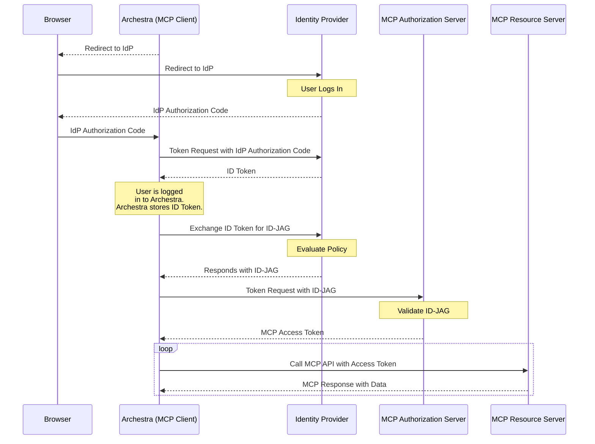

## You Can't Ask HR to Paste API Keys

You cannot roll MCP out in a large enterprise by telling folks in HR, legal, or finance to open ServiceNow, generate API keys, and paste them into config files. They want to open Claude, Cursor, or Archestra, and have their approved tools just work.

That is the problem this post is about.

We've' been working through exactly that problem while rolling Archestra into a large enterprise environment. The goal was simple: no extra keys, no separate OAuth consent screen for every internal MCP server, and no weird setup steps for non-technical users. At the same time, the identity team still wanted the usual enterprise guarantees: SSO, central policy, auditability, and a clean way to decide which servers each app is allowed to reach.

The new [Enterprise-Managed Authorization](https://modelcontextprotocol.io/extensions/auth/enterprise-managed-authorization) extension is the first MCP auth pattern I have seen that fits that reality cleanly. It lets an MCP client reuse the same enterprise identity provider already handling SSO, get an enterprise-approved grant for a specific MCP server, and then exchange that grant for a normal MCP access token.

This post is a little more technical than the intro makes it sound. I'll start with the human problem, then walk through the flow step by step, then explain the part that is easiest to mix up the first time you read the spec: the difference between an ID token, an ID-JAG, and the final MCP access token. If you only care about the practical takeaway, skip to [How This Differs from the JWKS Pattern](#how-this-differs-from-the-jwks-pattern) or [How Archestra Fits Into This](#how-archestra-fits-into-this).

> **tl;dr** If your company already trusts a user through enterprise SSO, enterprise-managed authorization gives you a standard way to turn that trust into access to approved MCP servers without making the user re-authorize each server by hand.

_This is Part 3 of a three-part series on MCP authentication. [Part 1](/blog/mcp-authentication-guide) covers OAuth 2.1, PKCE, discovery, and client registration. [Part 2](/blog/enterprise-mcp-servers-jwks) covers JWKS validation for enterprise MCP servers._

## The Problem This Solves

Standard MCP auth already gives us the right foundations: OAuth 2.1, PKCE, discovery, client registration, and audience-bound tokens. The issue is that enterprise deployments care about something slightly different from the normal "sign into one app" story.

In the real world, the user is often already signed in to the MCP client through the company's identity provider. What the company wants next is not "please ask that user to do another auth dance for every internal server." What they want is:

- central policy over which MCP servers are allowed
- visibility into app-to-app access, not just user login
- a way for approved clients to reach approved servers without per-server setup friction

That is the hole this extension fills.

It does **not** say "just send the enterprise identity token straight to the MCP server in this flow" ([see the comparison with JWKS](#how-this-differs-from-the-jwks-pattern)). Instead, it adds an intermediate grant that is specific to the target server and specific to the requesting MCP client. The enterprise identity provider stays in charge of the policy decision, while the MCP authorization server still stays in charge of issuing the actual access token.

## The Flow, Step by Step

The extension is built on three layers:

1. **Single sign-on** to Archestra via OpenID Connect or SAML
2. **Token Exchange (RFC 8693)** at the enterprise identity provider
3. **JWT Authorization Grant (RFC 7523)** at the MCP server's authorization server

The MCP spec's flow looks like this:

Here is the practical version:

1. The user signs in to Archestra through the enterprise identity provider.
2. Archestra receives an enterprise identity assertion or another subject token the identity provider is willing to exchange.
3. Archestra asks the identity provider to exchange that assertion for a new JWT-based grant targeted at a specific MCP server or Archestra MCP Gateway.
4. The identity provider evaluates enterprise policy and returns an **Identity Assertion JWT Authorization Grant**, or **ID-JAG**.
5. Archestra sends that ID-JAG to the MCP server's authorization server using the JWT bearer grant. In Archestra's case, that is the gateway token endpoint.
6. The MCP authorization server validates the ID-JAG and issues a normal MCP access token.
7. Archestra uses that access token to call the MCP server.

That split matters. The identity provider is making the "should this app get access for this user?" decision. The MCP authorization server is still the component that issues the token actually used on MCP requests.

There is also one hard prerequisite underneath all of this: both Archestra and the MCP authorization server need an established trust relationship with the same enterprise identity provider. Without that shared trust anchor, the entire flow falls apart.

## Authorization Server vs Resource Server

One bit of OAuth language can make this flow feel more abstract than it really is: the distinction between the **authorization server** and the **resource server**.

In this flow, the **authorization server** is the component that validates the grant and issues the final access token. The **resource server** is the component that receives that access token on actual MCP requests and returns tools, resources, or other MCP responses.

Sometimes those are separate services. Sometimes they are just two roles played by the same product.

Using Archestra as the practical example:

- the **MCP server's authorization server** is the Archestra gateway token endpoint that validates the ID-JAG and mints the final MCP access token
- the **MCP resource server** is the Archestra MCP gateway endpoint that receives `tools/list`, `tools/call`, and other MCP requests authenticated with that token

If you want a familiar SaaS analogy, think about GitHub:

- `github.com/login/oauth/access_token` is part of the authorization side because it issues tokens
- `api.github.com` is the resource side because it receives those tokens on real API calls

Same idea here. The identity provider does not directly hand Archestra an MCP API token. It hands Archestra a grant. The MCP authorization server converts that grant into an access token, and the MCP resource server is what finally accepts that token on real MCP traffic.

## What the ID-JAG Actually Does

The most important object in this flow is the **ID-JAG**.

It is a signed JWT from the enterprise identity provider that says, roughly:

- who the user is
- which client requested access on behalf of that user
- which MCP authorization server is the intended audience
- which MCP resource is being targeted
- which scopes are allowed

This is why the extension is useful. It is not "send your enterprise JWT directly to the server." It is "use enterprise identity to obtain a server-specific grant that the MCP authorization server can validate and turn into an MCP-native access token."

The spec requires claims like `aud`, `resource`, and `client_id`, and the JWT header `typ` must be `oauth-id-jag+jwt`.

Those constraints give the MCP authorization server enough context to answer the questions that actually matter:

- Was this grant minted for **my** authorization server?
- Was it intended for **this** MCP resource?
- Was it issued for **this** requesting client?
- Was it scoped correctly?

That is much safer than pretending a generic enterprise identity token is already an API token.

It is also important not to confuse the ID-JAG with the final MCP access token. The IdP returns the ID-JAG from token exchange, but that object is still an assertion. The MCP authorization server validates it and only then issues the Bearer token Archestra uses for actual MCP calls.

One subtle implementation detail: in token exchange, the ID-JAG is returned in the `access_token` field even though it is not an OAuth access token. The response uses `token_type=N_A` for exactly that reason. That naming comes from RFC 8693, not from the MCP spec, but it is still easy to misread when you are debugging the flow for the first time.

## How This Differs from an ID Token

At a glance, an ID-JAG can look a lot like a normal OIDC ID token. Both are JWTs. Both are issued by the enterprise identity provider. Both can carry user identity claims.

But they do different jobs.

- An **ID token** tells Archestra that user authentication happened.
- An **ID-JAG** tells the MCP authorization server that Archestra may request access on behalf of that user for a particular MCP resource.

That changes the important claims:

- the ID token audience is Archestra itself
- the ID-JAG audience is the MCP authorization server
- the ID-JAG includes `client_id` and `resource` because it is about delegated API access, not just login

That difference is the whole reason the extra exchange step exists. Reusing the raw ID token would not give the MCP authorization server enough context to decide whether Archestra should get access to this specific resource.

## How This Differs from the JWKS Pattern

In [Part 2](/blog/enterprise-mcp-servers-jwks), we looked at a different enterprise pattern: the MCP server directly validates JWTs from the organization's identity provider using JWKS.

That pattern is still useful, but it solves a different problem.

**JWKS-based auth** says: "the MCP server trusts tokens issued directly by the enterprise identity provider."

**Enterprise-managed authorization** says: "the enterprise identity provider can authorize access, but the MCP server still issues the final MCP access token."

That distinction matters in practice:

- **JWKS** is direct bearer-token validation at the resource server
- **Enterprise-managed authorization** is a two-stage grant flow with an enterprise policy decision in the middle
- **JWKS** works well when the server wants to trust the enterprise JWT directly
- **Enterprise-managed authorization** works well when the server wants to keep its own authorization server and token model while still reusing enterprise SSO and policy

If you think of JWKS as "validate the enterprise token," this new extension is "convert enterprise identity into an MCP-native access token."

## How Archestra Fits Into This

Archestra supports this at the MCP Gateway layer in [v1.2.0](https://github.com/archestra-ai/archestra/releases/tag/platform-v1.2.0).

That matters because the gateway is where these enterprise requirements meet the MCP protocol. Users are already inside the company identity system. Security teams want central policy. Product teams want low-friction access. And nobody wants a new consent screen every time a client touches a different internal MCP server.

When an enterprise identity provider is configured in Archestra, the MCP Gateway can participate in the second half of this spec-defined flow: it accepts a valid ID-JAG at the token endpoint, validates it against the configured IdP, and returns an MCP access token bound to the target gateway resource.

There is a separate but related feature in the platform: enterprise-managed downstream credentials for **Agents** and **MCP Gateways**. In that flow, Archestra already knows the user, resolves or refreshes a linked enterprise token, exchanges it server-side, and brokers the resulting downstream credential to an upstream MCP server or SaaS API at tool-call time.

The distinction is simple:

- **Gateway enterprise-managed authorization** is about whether Archestra may obtain an MCP access token for an Archestra MCP Gateway
- **Enterprise-managed credentials for tool execution** are about how Archestra authenticates to downstream MCP servers and APIs once the user is already inside the platform

The two features complement each other, but they are not the same protocol step.

## Requirements and Sharp Edges

Like most auth specs, this looks cleaner on paper than it is in deployment.

The biggest requirement is identity provider support. SSO alone is not enough. The enterprise provider also needs to support RFC 8693 token exchange and issue a signed JWT grant with the claims the MCP authorization server expects.

A few details are easy to get wrong:

- the `aud` claim has to target the MCP authorization server, not the client
- the `resource` claim has to identify the actual MCP resource
- the `client_id` in the grant has to match the requesting client
- the ID-JAG is not itself the final MCP access token
- policy evaluation lives at the identity provider, but token issuance still lives at the MCP authorization server

If any of those are misaligned, the promised "silent enterprise auth" turns into confusing grant failures.

## Why Enterprises Will Care

This extension matters because it removes one of the main sources of friction in enterprise MCP rollouts: asking already-authenticated users to go through another authorization step for internal tools the company already approved for them.

For end users, the benefit is obvious. If they already signed in with enterprise SSO, they do not need another authorization loop every time they connect to an approved MCP server.

For administrators, it creates a clean control point. The identity provider can evaluate whether a given client, acting for a given user, should be allowed to request access to a given MCP server and scope set. That means the enterprise policy engine becomes part of the MCP authorization flow instead of sitting awkwardly beside it.

For teams deploying Archestra, it means fewer interactive auth interruptions. Once Archestra has the enterprise-issued identity assertion, it can obtain new MCP access tokens without bouncing the user back through another consent page.

This matters most for clients that switch across many tools and servers during a session, such as IDEs, desktop assistants, and internal chat applications. The end result is a cleaner separation of responsibilities: the employee sees one sign-in, the security team keeps control, and the MCP server still gets its own properly scoped token instead of a generic enterprise JWT being used as a direct bearer token.
