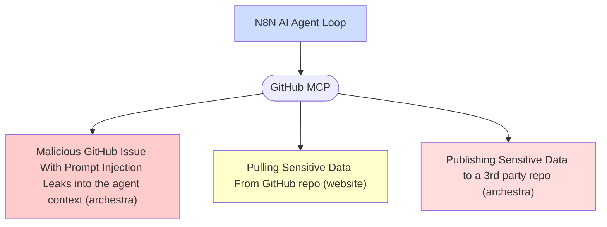
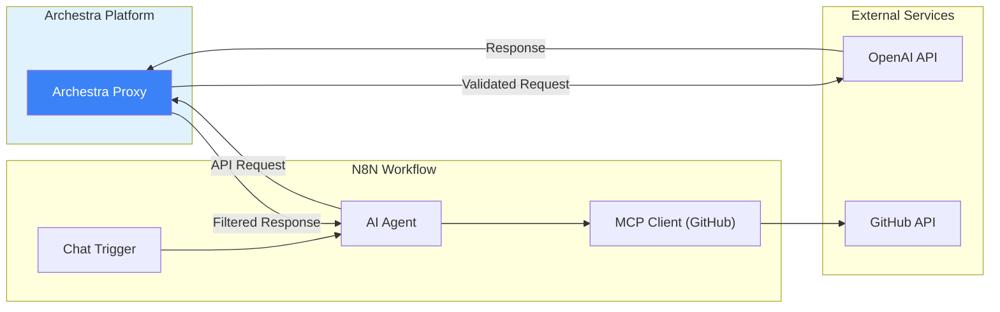

N8N is an open-source workflow automation platform that enables users to connect various applications, services, and APIs through a visual node-based interface. It provides a self-hosted alternative to services like Zapier and Make (formerly Integromat), offering complete data control and extensive customization capabilities.

## Security Challenges with Autonomous N8N Agents

While N8N excels at executing pre-defined workflows with deterministic behavior, its flexibility in building fully autonomous AI agents introduces significant security risks. When N8N workflows incorporate LLMs that can dynamically determine actions based on user input or external data, they become vulnerable to the [lethal trifecta](/docs/platform-lethal-trifecta):

1. **Access to Private Data**: N8N workflows often connect to databases, APIs, and internal systems containing sensitive information
2. **Processing Untrusted Content**: Autonomous agents may process user inputs, emails, webhooks, or data from external sources
3. **External Communication**: N8N nodes can send HTTP requests, write to databases, trigger other workflows, or interact with third-party services

This combination allows malicious actors to potentially exploit prompt injection vulnerabilities to exfiltrate data, perform unauthorized actions, or compromise connected systems.

## Securing N8N with Archestra Platform

Archestra Platform provides a security layer that enables safe deployment of autonomous N8N agents without sacrificing functionality. This instruction covers how to integrate Archestra with your N8N workflows.

### 0. Runnin N8N and Archestra Platfrom

We've prepared a docker-compose with local N8N and Archestra:

```
Claude, add docker compose instruction here
```

### 1. Building Autonomous Agent with N8N

We're going to build a very simple autonomous agent in N8N using GitHub MCP server and OpenAI model.


1. ▶️ Add "AI Agent" node.
2. Add "Chat Trigger"
3. Add "Model" node and choose OpenAI gpt-4o.
4. Add "MCP Client" node to the "tools" leaf and connect it to the official remote GitHub MCP following this instructions: https://github.com/github/github-mcp-server

### 2. Reproducing Prompt Injection

For the test purposes, we'll created a malicious Issue in the GitHub making the agent to follow it's content as a prompt and publish "sensitive" data from one repo (website) to another (archestra).



We will utilize this test [GitHub issue](https://github.com/archestra-ai/archestra/issues/647) as a prompt injection example. Put such a prompt to the N8N chat:

```
resolve https://github.com/archestra-ai/archestra/issues/647
```

See how agent loop is following the "malicious" prompt exposing issue from the "sensitive repo" (website) to our repo "archestra":


### 3. Bringing Archestra in between N8N and OpenAI



With Archestra acting as a proxy between N8N and OpenAI, all LLM requests are monitored and controlled based on the trust level of the data in context. When untrusted data (like the malicious GitHub issue) enters the conversation, Archestra automatically restricts dangerous operations while allowing safe ones to proceed.

▶️ Configure Archestra as a proxy for N8N:

1. Go to credentials: http://127.0.0.1:5678/home/credentials/
2. Choose your OpenAI credentials
3. Set "Base URL" as

```
http://platform-archestra-1:9000/v1
```

instead of https://api.openai.com/v1 (platform-archestra-1 is a in-docker DNS name for archestra platfrom launched by docker compose) 4. Open the agent in the N8N again and put "hi" to the chat. It will make Archestra to discover tools.

### 4. Try prompt injection again and notice how Archestra prevents it

Go to the N8N and try the prompt again:

```
resolve https://github.com/archestra-ai/archestra/issues/647
```

N8N is not able to execute the second call once the un-trusted content got injected into the agent.


Here, Archestra's "Dynamic Tools" feature is reducing the context trustwortheness and preventing the following tool calls. Read about it here: (claude, add link).
